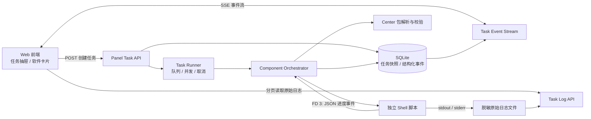
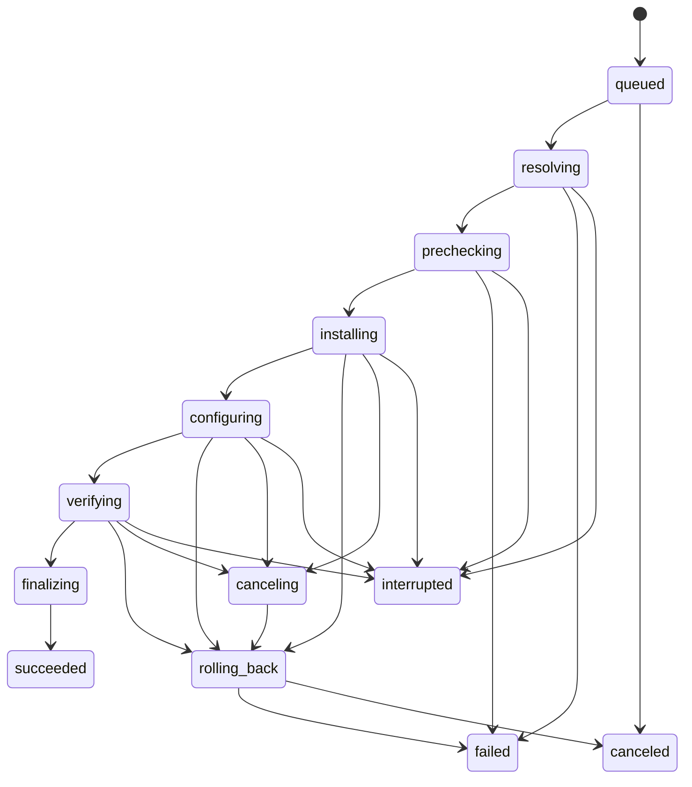

# Oneinstack Panel 安装进度系统设计

> 文档状态：P0 与四套组件精细进度已实现，真实系统验收待进行
> 设计范围：Panel 后端、Center 软件包、独立 Shell 安装脚本、Web 前端
> 目标：用户发起安装后，可以实时看到可信的阶段、进度、日志和最终结果；刷新页面、网络重连或后端重启后，任务状态仍可恢复。

## 1. 当前实现与主要问题

当前安装流程已经能够异步执行 Center 软件包，但进度展示仍是临时实现：

- `POST /v1/soft/install` 返回日志文件名，前端每 2 秒调用 `/v1/soft/getlog` 拉取完整日志。
- 前端收到安装接口响应后，立即在 `localStorage` 中写入“已安装版本”，安装失败时也可能显示为已安装。
- 日志只能说明“输出了什么”，不能可靠说明当前阶段、完成百分比和回滚状态。
- `internal/services/log/realtime_log.go` 中的 WebSocket 管理器是内存原型，没有接入当前 Center 安装执行链，服务重启后状态丢失。
- 现有进度解析函数尚未实现；通过匹配普通日志文本推断百分比，容易因脚本输出变化而失效。
- 当前取消能力仅依赖内部超时，没有用户主动取消、进程组终止和取消后的回滚流程。

因此，新功能不继续扩展“日志文件名 + 文本轮询”模式，而是在现有安装执行器外增加一层持久化任务系统。

## 2. 目标体验

用户点击“安装”后：

1. 接口在 500 ms 内返回安装任务 ID，页面立即出现任务面板。
2. 页面依次展示：
   - 获取 Center 软件包
   - 环境预检
   - 安装或升级
   - 写入配置
   - 启动并验证
3. 每个阶段显示状态、说明和可用时的阶段百分比，同时持续输出脱敏后的实时日志。
4. 用户关闭弹窗后，软件卡片和全局任务中心继续显示后台进度。
5. 刷新页面或短暂断网后，页面自动找回任务并从最后一个事件继续接收。
6. 只有任务真正成功并通过验证后，软件才显示为“已安装”。
7. 失败时明确展示失败阶段、错误码、可读原因和回滚结果。

第一版不承诺精确剩余时间。下载、编译和系统包安装的耗时变化较大，没有脚本内部进度时应显示“不确定进度”，不能用匀速动画伪造百分比。

## 3. 总体架构



核心职责分离：

- **Task API**：创建、查询、取消和恢复任务。
- **Task Runner**：排队、并发限制、任务上下文、超时和取消。
- **Component Orchestrator**：继续负责 `precheck → install/upgrade → configure → verify → rollback`。
- **脚本进度通道**：Shell 脚本通过独立文件描述符输出结构化进度，普通安装输出仍进入 stdout/stderr。
- **SQLite**：保存任务快照和关键事件，作为前端状态的唯一可信来源。
- **原始日志文件**：保存大体积命令输出，避免 SQLite 因日志逐行写入而快速膨胀。
- **SSE**：向浏览器推送单向实时事件；当前产品是服务端向页面单向报告进度，不需要 WebSocket 的双向复杂度。

## 4. 安装任务状态机



建议状态定义：

| 状态 | 含义 | 是否终态 |
| --- | --- | --- |
| `queued` | 已创建，等待执行 | 否 |
| `resolving` | 获取内置包或从 Center 下载并校验包 | 否 |
| `prechecking` | 系统、网络、端口、磁盘、依赖检查 | 否 |
| `installing` / `upgrading` | 执行软件安装或升级 | 否 |
| `configuring` | 写入配置、权限和服务定义 | 否 |
| `verifying` | 启动服务并进行健康检查 | 否 |
| `finalizing` | 落库软件状态、清理临时文件 | 否 |
| `canceling` | 已收到取消请求，正在停止进程 | 否 |
| `rolling_back` | 正在执行回滚 | 否 |
| `succeeded` | 安装和验证成功 | 是 |
| `failed` | 安装失败，包含回滚结果 | 是 |
| `canceled` | 用户取消，包含回滚结果 | 是 |
| `interrupted` | Panel 异常退出，任务等待人工处理或状态核验 | 是 |

任务失败后需要在结果中单独记录：

- `rollback_status`: `not_required | succeeded | failed`
- `failure_phase`: 发生错误的阶段
- `error_code`: 稳定、可检索的错误码
- `error_message`: 已脱敏的用户可读原因

不建议把 `failed_rolled_back` 等组合状态扩散到所有前端判断中，主状态和回滚状态分字段更易维护。

## 5. 持久化模型

### 5.1 `software_task`

保存任务当前快照，页面列表和断线恢复主要读取该表。

| 字段 | 类型 | 说明 |
| --- | --- | --- |
| `id` | string / ULID | 任务 ID，按时间有序 |
| `operation` | string | `install / upgrade / uninstall` |
| `component` | string | `nginx / mysql / php / redis` |
| `requested_version` | string | 用户选择版本 |
| `resolved_version` | string | Center 或内置包实际解析版本 |
| `package_source` | string | `builtin / center / cache` |
| `status` | string | 当前任务状态 |
| `phase` | string | 当前阶段 |
| `phase_progress` | nullable int | 当前阶段 0～100；未知时为 NULL |
| `progress` | int | 总体进度 0～100 |
| `message` | string | 当前安全提示 |
| `error_code` | string | 稳定错误码 |
| `error_message` | string | 脱敏错误说明 |
| `rollback_status` | string | 回滚状态 |
| `requested_by` | uint | 发起用户 ID |
| `cancel_requested` | bool | 是否请求取消 |
| `event_seq` | int64 | 最后一个事件序号 |
| `log_path` | string | 内部日志路径，不向普通 API 返回 |
| `created_at` | datetime | 创建时间 |
| `started_at` | nullable datetime | 开始时间 |
| `heartbeat_at` | nullable datetime | Worker 心跳 |
| `finished_at` | nullable datetime | 结束时间 |
| `updated_at` | datetime | 更新时间 |

必要索引：

- `(status, created_at)`：读取活动任务和队列。
- `(component, created_at)`：软件详情任务历史。
- `(requested_by, created_at)`：用户任务中心。

### 5.2 `software_task_event`

保存关键结构化事件，支持 SSE 断线续传。普通 stdout/stderr 不逐行写入该表。

| 字段 | 类型 | 说明 |
| --- | --- | --- |
| `task_id` | string | 任务 ID |
| `seq` | int64 | 任务内单调递增序号 |
| `type` | string | `snapshot / phase / progress / warning / terminal` |
| `level` | string | `info / warning / error` |
| `phase` | string | 所属阶段 |
| `progress` | nullable int | 总体进度 |
| `code` | string | 机器可读事件代码 |
| `message` | string | 已脱敏展示文本 |
| `created_at` | datetime | 事件时间 |

唯一索引：`(task_id, seq)`。

### 5.3 组件操作锁

当前进程内锁不足以处理 Panel 重启。增加 `component_operation_lock`：

- `component`：主键
- `task_id`
- `acquired_at`
- `heartbeat_at`

创建任务或开始执行时在事务内加锁，同一组件只能存在一个活动变更任务。不同组件可以并行，第一版建议总并发数为 2。启动时核验过期锁，不直接重新执行旧脚本。

## 6. 可信进度计算

### 6.1 阶段权重

总体进度由编排器计算，脚本不能直接修改总体百分比：

| 阶段 | 总进度区间 |
| --- | --- |
| `resolving` | 0～5 |
| `prechecking` | 5～12 |
| `installing / upgrading` | 12～72 |
| `configuring` | 72～84 |
| `verifying` | 84～96 |
| `finalizing` | 96～100 |

计算方式：

```text
总体进度 = 阶段起点 + 阶段权重 × 阶段进度
```

规则：

- 阶段开始和结束由 Go 编排器自动发布事件。
- 脚本提供阶段内部进度时，映射到该阶段区间。
- 脚本没有内部进度时，`phase_progress = null`，前端显示阶段内不确定动画；阶段结束时直接进入下一阶段。
- 主流程进度不允许倒退。
- 进入回滚时冻结主流程进度，页面另显示“回滚步骤”，避免进度条从 70% 倒退造成误解。
- 不通过扫描日志关键字或按已用时间推测百分比。

### 6.2 Shell 脚本结构化进度协议

Panel 为脚本打开文件描述符 3：

```text
ONEINSTACK_PROGRESS_FD=3
```

脚本只在 FD 3 输出一行一个 JSON 事件：

```json
{"type":"progress","percent":35,"code":"compile","message":"正在编译 Nginx"}
```

stdout/stderr 继续输出完整命令日志。这样不会因编译器、系统包管理器或第三方命令的输出内容变化而破坏进度解析。

建议所有独立脚本提供统一帮助函数：

```sh
emit_progress() {
  percent="$1"
  code="$2"
  message="$3"
  printf '{"type":"progress","percent":%s,"code":"%s","message":"%s"}\n' \
    "$percent" "$code" "$message" >&3
}
```

Go 端必须严格校验：

- `percent` 为 0～100。
- `code` 只允许小写字母、数字、下划线和短横线。
- `message` 最长 256 字节，移除控制字符。
- 非法 JSON 只记录警告，不中断正常安装输出。
- 每秒限制进度事件数量，防止脚本错误造成事件风暴。

Nginx、MySQL 8.0、PHP、Redis 脚本统一使用以下事件代码：

- `download`
- `verify_checksum`
- `extract`
- `install_dependencies`
- `prepare_build`
- `compile`
- `install_files`
- `write_config`
- `service_start`
- `health_check`

不同软件可以跳过不适用步骤，但不得复用同一个代码表达不同含义。

## 7. 后端 API

### 7.1 创建安装任务

```http
POST /v1/soft/install
Content-Type: application/json
```

保留现有路径以降低前端迁移成本，响应改为 HTTP `202 Accepted`：

```json
{
  "taskId": "01J...",
  "operation": "install",
  "component": "nginx",
  "status": "queued",
  "progress": 0,
  "statusUrl": "/v1/soft/tasks/01J...",
  "streamUrl": "/v1/soft/tasks/01J.../events"
}
```

创建接口只负责校验请求、持久化任务并入队，不等待 Center 下载或脚本执行。

### 7.2 查询任务

```http
GET /v1/soft/tasks/:taskId
GET /v1/soft/tasks?active=true
GET /v1/soft/tasks?component=nginx&page=1&pageSize=20
```

页面首次加载必须调用活动任务列表，不能依赖浏览器 `localStorage` 判断安装是否仍在进行。

### 7.3 SSE 实时事件

```http
GET /v1/soft/tasks/:taskId/events
Accept: text/event-stream
Last-Event-ID: 41
```

事件示例：

```text
id: 42
event: progress
data: {"taskId":"01J...","status":"installing","phase":"installing","phaseProgress":35,"progress":33,"code":"compile","message":"正在编译 Nginx","at":"2026-07-24T10:30:00+08:00"}

```

终态事件：

```text
id: 67
event: terminal
data: {"taskId":"01J...","status":"succeeded","phase":"finalizing","progress":100,"message":"Nginx 安装并验证成功","at":"2026-07-24T10:38:00+08:00"}

```

SSE 服务规则：

- 连接建立时先发送最新任务快照。
- 使用数据库事件序号作为 SSE `id`。
- 支持 `Last-Event-ID` 或 `?after=<seq>` 从断点续传。
- 每 15 秒发送注释心跳，避免反向代理关闭空闲连接。
- 终态事件发送后关闭连接。
- 设置 `Cache-Control: no-cache` 和 `X-Accel-Buffering: no`。
- Nginx 对该路径关闭响应缓冲，并设置足够长的读取超时。

当前认证使用同源 HttpOnly Cookie，SSE 可以复用现有会话。开发环境跨域时使用 `new EventSource(url, { withCredentials: true })` 并严格配置允许来源。

### 7.4 分页日志

```http
GET /v1/soft/tasks/:taskId/log?cursor=0&limit=65536
```

返回：

```json
{
  "content": "...",
  "nextCursor": 42180,
  "eof": false
}
```

日志按字节游标增量读取，禁止每次返回完整文件。限制单次最大读取量，下载完整日志使用单独接口和审计权限。

### 7.5 取消任务

```http
POST /v1/soft/tasks/:taskId/cancel
```

处理顺序：

1. 事务内写入 `cancel_requested = true`。
2. Task Runner 取消对应 Context。
3. 向脚本进程组发送 `SIGTERM`。
4. 等待最多 10 秒，仍未退出则发送 `SIGKILL`。
5. 根据动作是否产生副作用进入回滚。
6. 发布 `canceled` 终态事件。

不可安全中断的短暂阶段可以返回 `cancelable: false`。脚本后续可扩展安全取消点，但第一版不在执行任意数据库迁移的中间位置强制退出。

### 7.6 错误码

第一批稳定错误码：

- `CENTER_UNAVAILABLE`
- `PACKAGE_NOT_FOUND`
- `PACKAGE_VERIFY_FAILED`
- `PRECHECK_FAILED`
- `INSUFFICIENT_DISK_SPACE`
- `ACTION_TIMEOUT`
- `ACTION_CANCELED`
- `INSTALL_FAILED`
- `CONFIGURE_FAILED`
- `VERIFY_FAILED`
- `ROLLBACK_FAILED`
- `PANEL_RESTARTED`

错误码用于页面提示、检索和后续支持中心聚合，不把 Shell 的退出文本直接作为接口错误。

## 8. 前端页面设计

### 8.1 安装任务抽屉

安装弹窗在任务创建后切换为任务抽屉，包含：

1. **头部**
   - 软件图标、名称、目标版本
   - 安装/升级状态标签
   - 已用时间
2. **总体进度**
   - 有可靠进度时显示百分比
   - 阶段进度未知时显示不确定状态并保留已完成阶段
3. **阶段步骤条**
   - 获取安装包
   - 环境预检
   - 安装/升级
   - 写入配置
   - 启动与验证
4. **当前动作**
   - 例如“正在编译 Nginx”
   - warning 和 error 使用不同颜色及图标
5. **实时日志**
   - 默认折叠，终端风格
   - 自动滚动开关
   - 复制当前日志、下载完整日志
   - 不使用不可检索的大型只读 textarea
6. **操作按钮**
   - 运行中：`后台运行`、`取消任务`
   - 成功：`完成`
   - 失败：`复制诊断信息`、`重新填写并重试`

涉及 MySQL root 密码等秘密参数时，失败重试必须重新填写，不能从任务详情接口取回。

### 8.2 软件卡片

存在活动任务时：

- 卡片显示小型进度条、当前阶段和百分比。
- 禁用同一组件的安装、升级和卸载按钮。
- 点击进度区域重新打开任务抽屉。
- 仅当后端任务成功并更新软件状态后，展示“已安装”及实际版本。

删除当前以 `localStorage.installedVersions` 作为安装结果依据的逻辑。浏览器只可以缓存最近查看的 `taskId`，软件状态必须来自后端。

### 8.3 全局任务中心

导航栏增加任务入口：

- 显示活动任务数量。
- 展示运行中、失败、已完成任务。
- 支持按软件、状态和时间筛选。
- 点击任务进入同一个任务详情抽屉。

### 8.4 断线与页面刷新

前端恢复流程：

1. 页面加载请求 `GET /v1/soft/tasks?active=true`。
2. 为每个活动任务建立 SSE，或由全局任务 Store 统一管理连接。
3. SSE 断开后指数退避重连，浏览器自动携带 `Last-Event-ID`。
4. 连续失败时每 3 秒轮询任务快照作为降级方案。
5. 收到终态事件后刷新软件列表，并停止 SSE 和轮询。

前端使用 Pinia/全局 Store 保存任务，不能把 SSE 连接生命周期放在单个弹窗组件中，否则关闭弹窗会停止接收进度。

## 9. 密码与日志安全

安装任务是异步的，秘密参数必须单独处理：

- 普通参数和秘密参数分开解析。
- 秘密参数不得写入任务快照、事件、审计详情、API 响应和原始日志。
- 不通过命令行参数传递密码，继续使用受控环境变量或标准输入。
- Task Runner 建立精确值脱敏器，写入 stdout/stderr 日志前替换本次任务所有秘密值。
- 如需支持排队任务跨 Panel 重启继续执行，使用实例级 0600 密钥对秘密参数进行 AES-256-GCM 信封加密；AAD 包含任务 ID。
- 任务进入终态后立即清空加密秘密字段。
- 不复用 JWT 密钥作为数据加密密钥。
- 前端“复制诊断信息”只包含任务 ID、组件、版本、错误码、阶段和脱敏日志片段。

第一版如果不实现加密持久化，则包含秘密的任务不能在重启后自动重试，必须明确标记 `interrupted` 并要求用户重新提交。

## 10. Panel 重启恢复

Panel 启动时执行任务核验：

1. 查询所有非终态任务和组件锁。
2. 心跳超时且不存在受管子进程的任务标记为 `interrupted`。
3. 读取组件实际状态、服务状态和版本：
   - 已安装且健康：允许管理员确认完成，或由严格的验证器自动修正为成功。
   - 部分安装：提示执行清理/回滚。
   - 未产生副作用：允许用户重新提交。
4. 不盲目重新执行安装脚本，避免重复初始化 MySQL、覆盖配置或破坏数据。
5. 清理过期组件锁后才允许新任务。

后续要实现真正的跨重启续跑，脚本需要显式幂等步骤和 checkpoint；不应在第一版中假设任意 Shell 脚本可以安全续跑。

## 11. 兼容与迁移

- 保留 `/v1/soft/getlog` 一个版本周期，现有调用继续可用，但新前端不再使用。
- 新 Task Runner 接入后，弃用 `internal/services/log/realtime_log.go` 的内存 WebSocket 流，不维护两套实时状态。
- 现有 Component Orchestrator 的阶段、超时、锁和回滚逻辑继续复用，只增加事件发布器和外部取消 Context。
- Center 包格式向后兼容：没有结构化进度的旧脚本仍可执行，页面显示阶段级不确定进度。
- 新发布的 Nginx、MySQL 8.0、PHP、Redis 脚本逐个加入 FD 3 进度协议。

## 12. 开发分期

### P0：完整可用的实时进度

- 新增任务表、事件表、迁移和 Repository。
- 安装接口改为创建任务并返回任务 ID。
- Task Runner 接入当前 Center 安装执行链。
- Orchestrator 发布阶段、进度、警告和终态事件。
- 实现任务查询、活动任务列表、SSE 和增量日志 API。
- 前端实现全局任务 Store、安装任务抽屉、步骤条、实时日志和刷新恢复。
- 安装成功后再更新软件状态，移除前端本地伪状态。
- 旧脚本先显示阶段级进度。

### P1：脚本精细进度与安全取消

- Nginx、MySQL 8.0、PHP、Redis 脚本加入 FD 3 JSON 进度事件。
- 实现进程组取消、取消安全性、回滚进度和结果展示。
- 增加全局任务中心和完整日志下载。
- 加入任务秘密加密、日志精确值脱敏测试。

### P2：生产恢复与运维能力

- 启动时任务和组件状态核验。
- 任务、事件和日志自动保留/清理策略。
- 任务成功率、耗时、错误码统计。
- 按组件和版本积累历史耗时后，提供有置信度的预计剩余时间。
- 支持依赖任务图，例如 PHP 安装依赖已有 Web Server 或数据库能力。

建议开发顺序为 P0 后端任务引擎 → P0 前端 → P1 四个脚本 → P1 取消与安全 → P2 恢复和观测。

## 13. 验收标准

### 功能

- 创建安装任务接口在 500 ms 内返回任务 ID。
- 前端在任务创建后 1 秒内显示 `queued` 或当前阶段。
- 用户关闭抽屉、刷新页面后仍能恢复活动任务。
- 网络断开再连接后不会丢失关键阶段和终态事件。
- 软件只在脚本成功且健康检查通过后显示为已安装。
- 安装失败会展示失败阶段、错误码、日志和回滚结果。
- 同一组件不能同时安装、升级或卸载；不同组件按配置并发。

### 安全

- 数据库任务、事件、API、审计和日志中均找不到提交的明文密码。
- 普通用户只能查看自己有权限访问的任务。
- SSE 校验会话和任务权限，不允许任意 Origin。
- 日志 API 有单次读取上限，日志下载有权限和审计。

### 稳定性

- SSE 有心跳、断点续传和轮询降级。
- 10 MB 以上安装日志不会导致接口一次性读入全部内容。
- Panel 重启后不会把中断任务错误标记为成功，也不会自动重复初始化数据库。
- 强制制造 Center 不可达、校验失败、脚本退出、超时、验证失败等情况时，状态机都能进入正确终态。

### 测试

- 状态机单元测试覆盖合法和非法转换。
- 阶段权重和进度单调性单元测试。
- SSE 断线续传集成测试。
- 任务锁和并发创建测试。
- 密码脱敏和日志注入测试。
- 脚本 FD 3 协议测试。
- Nginx、MySQL 8.0、PHP、Redis 至少各完成一次容器/虚拟机安装冒烟测试。

## 14. 首批代码落点

后端建议新增：

```text
internal/models/software_task.go
internal/services/softwaretask/repository.go
internal/services/softwaretask/runner.go
internal/services/softwaretask/events.go
internal/services/softwaretask/redactor.go
router/handler/software/task.go
```

修改：

```text
router/handler/software/software.go
internal/services/software/component_executor.go
internal/services/software/installer.go
router/router.go
app/db.go
```

前端建议新增：

```text
src/stores/softwareTask.ts
src/views/pages/software/components/InstallTaskDrawer.vue
src/views/pages/software/components/InstallTaskSteps.vue
src/views/pages/software/components/InstallTaskLog.vue
src/views/pages/software/components/TaskCenter.vue
```

修改：

```text
src/api/Api.ts
src/views/pages/software/components/all.vue
```

此设计完成后，进度系统将以“任务事实”驱动界面，日志只作为诊断信息，不再承担安装状态数据库的职责。

## 15. 2026-07-24 实施记录

P0 已完成：

- 新增 `software_task`、`software_task_event` 和 `component_operation_lock` 持久化模型及自动迁移。
- 新增双 Worker Task Runner、同组件任务互斥、任务取消、心跳和 Panel 重启中断核验。
- 安装和卸载接口均已改为返回 HTTP 202 和任务 ID。
- 已实现任务快照、活动任务列表、SSE 断点事件流、增量日志和取消 API。
- 当前 Component Orchestrator 已接入预检、安装/升级、配置、验证、卸载和回滚事件。
- 脚本执行支持调用方 Context、进程组 SIGTERM/SIGKILL 和 FD 3 JSON 进度协议。
- 任务参数不持久化密码；安装日志在写入前进行精确值脱敏，临时脚本权限收紧为 0700。
- 前端已实现全局任务状态、任务抽屉、安装/卸载步骤进度、实时日志、软件卡片进度、任务入口、刷新恢复、SSE 重连和快照轮询降级。
- 已移除软件安装结果对 `localStorage.installedVersions` 的依赖，安装成功后以后端软件状态为准。
- 新前端生产包已同步到 Panel 的 `webui/app.zip`。
- Oneinstack-Center 中 Nginx、MySQL 8.0、PHP 和 Redis 的生产脚本已增加 FD 3 结构化进度，并重新生成 Panel 内置包和 `files.sha256`。
- 任务摘要默认保留 90 天，事件和日志默认保留 30 天；后台清理调度、完整日志下载和任务统计 API 已实现。
- Panel 重启和优雅关闭均会将未完成任务标记为中断并核验真实组件状态，不会自动重复执行脚本。

已完成验证：

- Go 全量测试通过。
- Task Runner、安装/卸载、取消、重启中断、日志游标、密码不落库、跨分块日志脱敏、FD 3 进度协议和 SSE 终态事件均有自动化覆盖。
- 前端 TypeScript 类型检查通过。
- 前端 Vitest 测试通过。
- 前端生产构建和 Panel 嵌入包校验通过。
- Center 全量 Go 测试、四套脚本 Bash 语法检查、进度 JSON 校验及四个内置包 SHA-256 校验通过。

P1 待完成：

- 在 Ubuntu 22.04/24.04 干净系统执行真实安装、取消、回滚和重启中断验收。
- 如需让含密码的排队任务跨 Panel 重启续跑，再增加实例级加密密钥和秘密参数信封加密。
