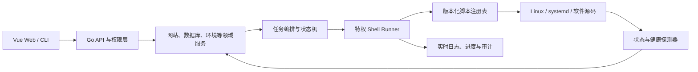

# OneinStack Panel 产品蓝图

> 产品定位：宝塔级服务器管理能力 + OneinStack Shell 环境安装内核
> 文档状态：开发基线
> 制定日期：2026-07-24

## 1. 产品定位

OneinStack Panel 的目标是成为一套完整的 Linux 服务器 Web 运维面板。

产品能力以成熟服务器面板的功能体系为参照，覆盖网站、运行环境、数据库、文件、FTP、SSL、Docker、监控、安全、计划任务、备份、日志、终端、插件、API 和多节点等功能。

项目不复制宝塔的专有代码、界面、品牌、私有协议或商业插件。对标的是用户任务和功能完整性，底层实现保持独立。

核心差异是：

| 维度 | 常规面板模式 | OneinStack Panel 模式 |
| --- | --- | --- |
| 环境安装 | 面板内部包管理器或私有安装逻辑 | 版本化 OneinStack 风格 Shell 脚本 |
| 软件构建 | 二进制包为主 | 支持源码编译、参数化构建和多版本共存 |
| 脚本入口 | 对用户隐藏 | 脚本既可被面板调用，也可独立在 CLI 执行 |
| 安装状态 | 面板数据库记录为主 | 系统探测结果为准，数据库记录用于编排和审计 |
| 可恢复性 | 依赖具体实现 | 每个脚本动作定义预检、验证、清理和回滚 |
| 离线能力 | 常依赖云端 | 支持镜像、离线包和自托管脚本仓库 |
| 开放性 | 插件体系可能封闭 | OpenAPI、事件钩子和开放插件规范 |

## 2. 产品原则

### 2.1 Shell-first，但不允许任意 Shell

软件安装、升级、卸载、服务配置等系统变更必须由已注册的 Shell 动作完成。HTTP 请求只能提交脚本 ID 和经过 schema 验证的参数，不能提交任意命令。

Web 终端属于独立的高风险能力，不进入脚本任务引擎。

### 2.2 实际系统状态优先

软件是否安装、服务是否运行、版本号和配置路径，应通过系统探测器获得。不能仅根据面板数据库里的 `installed=true` 判断。

### 2.3 所有变更可验证、可审计、可恢复

每次系统变更都必须具有：

- 变更前检查。
- 资源锁。
- 结构化进度。
- 脱敏日志。
- 执行后验证。
- 失败清理或回滚。
- 操作人和来源审计。

### 2.4 默认安全

- 所有管理接口默认需要认证和授权。
- 高风险功能默认关闭。
- 面板默认使用 HTTPS。
- 软件源、安装包和脚本必须校验完整性。
- 不默认关闭防火墙、替换系统软件源或全量升级操作系统。

### 2.5 面板与 Shell 双入口一致

同一项能力必须复用同一套脚本和状态探测器：

- Web 面板调用任务 API。
- CLI 调用同一任务引擎。
- 运维人员可直接运行受支持的 Shell 包。

不能维护两套行为不同的安装逻辑。

## 3. 目标用户

- 个人开发者和站长。
- 中小企业技术人员。
- 建站、外包和托管服务团队。
- 需要源码编译和定制运行环境的开发者。
- 需要离线、自托管或国内镜像部署的用户。

首个稳定版优先支持单机单管理员。多管理员和多节点作为后续增强，但架构和数据模型要预留。

## 4. 产品信息架构

建议主导航：

1. 概览
2. 网站
3. 运行环境
4. 数据库
5. Docker
6. 文件
7. FTP
8. SSL
9. 监控
10. 安全
11. 计划任务
12. 备份与迁移
13. 日志与审计
14. 终端
15. 应用商店
16. 告警
17. 设置
18. 节点管理

首发版本可以隐藏尚未完成的模块，但路由、权限和菜单配置应由后端能力清单统一控制，不能只在前端写死。

## 5. 完整功能地图

状态定义：

- Core：v1.0 必须具备。
- Plus：v1.x 增强。
- Future：产品成熟阶段。

### 5.1 概览

| 功能 | 版本 |
| --- | --- |
| CPU、内存、负载、磁盘、网络实时状态 | Core |
| 操作系统、内核、运行时间、公网/内网 IP | Core |
| Nginx、数据库、PHP、Redis 等服务状态 | Core |
| 网站、数据库、任务、证书和备份数量 | Core |
| 正在运行和最近完成的后台任务 | Core |
| 安全风险、磁盘不足、证书过期提示 | Core |
| 资源历史曲线和时间范围切换 | Core |
| 首页组件拖拽和自定义 | Plus |
| 多节点状态聚合 | Future |

### 5.2 网站与项目

| 功能 | 版本 |
| --- | --- |
| 静态网站 | Core |
| PHP 网站和多 PHP 版本切换 | Core |
| 反向代理网站 | Core |
| 域名、泛域名、IPv4/IPv6、非标准端口 | Core |
| 网站根目录、运行目录、默认文档、错误页 | Core |
| 启用、停用、删除和批量操作 | Core |
| Nginx 配置预览、校验、原子应用和回滚 | Core |
| 伪静态、重定向、反向代理、请求头 | Core |
| HTTPS、强制 HTTPS、HSTS | Core |
| 访问日志、错误日志、日志轮转 | Core |
| 防盗链、目录保护、IP 黑白名单 | Core |
| Git 拉取与部署钩子 | Plus |
| Node.js/PM2 项目 | Plus |
| Java/JAR/Tomcat 项目 | Plus |
| Python/Gunicorn 项目 | Plus |
| Go 二进制项目 | Plus |
| 一键部署应用模板 | Plus |
| WordPress 专用管理和安全工具 | Future |
| Docker 网站统一接入 | Future |

网站创建可以同时创建数据库和 FTP 账号，但必须以一个可回滚的工作流执行；任一步失败时，不保留半完成资源。

### 5.3 运行环境

| 功能 | 版本 |
| --- | --- |
| Nginx 安装、卸载、升级、服务控制 | Core |
| MySQL 8 安装、升级和服务控制 | Core |
| Redis 安装、升级和服务控制 | Core |
| PHP 8.1/8.2/8.3 多版本安装 | Core |
| PHP 扩展安装、卸载和配置 | Core |
| 软件配置编辑、验证和恢复默认 | Core |
| 服务状态、端口、进程、日志和资源占用 | Core |
| 安装进度、失败原因、重试和清理 | Core |
| OpenResty、Tengine、Apache | Plus |
| MariaDB、Percona、PostgreSQL、MongoDB | Plus |
| Memcached、Pure-FTPd、phpMyAdmin | Plus |
| JDK、Tomcat、Node.js、Supervisor | Plus |
| Caddy 和扩展 Web Server | Future |
| 编译参数和高级优化模板 | Future |

软件版本支持范围由脚本注册表决定，前端不得自行维护版本列表。

### 5.4 数据库

| 功能 | 版本 |
| --- | --- |
| MySQL 数据库创建、修改、删除 | Core |
| 独立数据库用户和访问权限 | Core |
| 本地数据库同步/接管 | Core |
| 连接测试和服务状态 | Core |
| 导入、导出、备份和恢复 | Core |
| 定时备份和保留策略 | Core |
| 本机、指定 IP、IP 段访问权限 | Core |
| Root 密码安全修改 | Core |
| Redis 状态、配置、数据库和键浏览 | Core |
| 慢查询、进程列表和性能状态 | Plus |
| MySQL 日志、二进制日志和增量备份 | Plus |
| PostgreSQL、MongoDB、SQLite 管理 | Plus |
| 远程数据库统一管理 | Plus |
| 数据库高可用和主从复制 | Future |

密码必须加密保存；列表接口只返回“已配置”状态，不能返回原始密码。

### 5.5 文件管理

| 功能 | 版本 |
| --- | --- |
| 授权目录内浏览、搜索、排序 | Core |
| 创建、复制、移动、重命名、删除 | Core |
| 上传、下载、分片上传和断点续传 | Core |
| 文本编辑、编码识别和只读预览 | Core |
| 压缩和解压 | Core |
| 权限、所有者和用户组 | Core |
| 回收站和恢复 | Core |
| 文件哈希和大小统计 | Core |
| 操作审计和危险路径保护 | Core |
| 远程 URL 下载的安全白名单 | Plus |
| 文件分享、临时下载链接 | Plus |
| 恶意文件和 WebShell 扫描 | Plus |

文件 API 永远不接受可以逃逸授权根目录的路径。面板目录、密钥、系统伪文件系统和设备文件必须显式禁止。

### 5.6 FTP

| 功能 | 版本 |
| --- | --- |
| Pure-FTPd 安装和状态管理 | Plus |
| FTP 用户创建、停用、改密和删除 | Plus |
| 绑定目录和空间配额 | Plus |
| 登录日志和异常告警 | Plus |
| FTPS | Plus |

FTP 不作为 v1.0 上线阻断项，优先推荐 SFTP 或受控文件管理。

### 5.7 SSL 证书

| 功能 | 版本 |
| --- | --- |
| 上传证书和私钥 | Core |
| Let's Encrypt HTTP-01 申请 | Core |
| 自动续签、失败重试和到期告警 | Core |
| 证书部署到网站和面板 | Core |
| 证书列表、域名、签发方和到期时间 | Core |
| DNS-01 和通配符证书 | Plus |
| DNS 服务商凭据管理 | Plus |
| OCSP、证书链检查和部署历史 | Plus |
| 跨节点/第三方平台部署 | Future |

### 5.8 Docker

| 功能 | 版本 |
| --- | --- |
| Docker/Compose Shell 安装 | Plus |
| 容器列表、创建、启动、停止、重启、删除 | Plus |
| 容器日志、终端、资源和端口 | Plus |
| 本地/远程镜像、拉取和删除 | Plus |
| 网络和存储卷 | Plus |
| Compose 项目创建和生命周期 | Plus |
| Registry 凭据 | Plus |
| Compose 备份和恢复 | Plus |
| Docker 应用模板商店 | Plus |
| Docker 网站与反向代理联动 | Future |

Docker 是成为完整服务器面板的必要能力，但排在主机网站核心稳定之后。

### 5.9 监控、告警与守护

| 功能 | 版本 |
| --- | --- |
| CPU、内存、负载、磁盘和网络历史 | Core |
| 服务、端口和进程状态 | Core |
| 采集间隔和数据保留设置 | Core |
| 资源阈值告警 | Core |
| 证书、备份、任务和磁盘告警 | Core |
| 邮件和 Webhook 通知 | Core |
| 钉钉、企业微信、飞书 | Plus |
| 服务异常自动拉起 | Plus |
| 面板日报和周报 | Plus |
| 多节点统一监控 | Future |

### 5.10 安全中心

| 功能 | 版本 |
| --- | --- |
| 系统防火墙端口与 IP 规则 | Core |
| 面板端口保护和防自锁 | Core |
| 登录限流、失败锁定、登录记录 | Core |
| TOTP 双因素认证 | Core |
| 面板 HTTPS 和安全入口 | Core |
| SSH 端口、root 登录和密码策略检查 | Core |
| SSH 防爆破与封禁记录 | Plus |
| 系统账号、危险权限和服务检查 | Plus |
| 软件弱口令与配置风险检查 | Plus |
| WebShell、恶意进程和 rootkit 检测 | Plus |
| Nginx WAF 和网站防篡改 | Future |
| PassKey、客户端证书和临时授权 | Future |

安全评分只作为风险展示，不能用一个分数替代明确的风险项和修复记录。

### 5.11 计划任务

| 功能 | 版本 |
| --- | --- |
| Shell、URL、网站备份、数据库备份任务 | Core |
| Cron 表达式和常用周期 | Core |
| 启用、停用、复制和手动执行 | Core |
| 超时、并发策略、失败重试 | Core |
| 日志、保留期限和结果通知 | Core |
| 日志切割、目录清理和服务检查模板 | Plus |
| 云存储备份任务 | Plus |

普通任务使用受控模板。允许自定义 Shell 时必须明确标记为 root 高风险操作，并记录完整审计。

### 5.12 备份、恢复与迁移

| 功能 | 版本 |
| --- | --- |
| 网站和数据库本地备份 | Core |
| 手动恢复、下载和删除 | Core |
| 定时策略和保留数量 | Core |
| 面板配置与元数据备份 | Core |
| 恢复前完整性、版本和空间检查 | Core |
| S3 兼容对象存储 | Plus |
| 阿里 OSS、腾讯 COS、七牛等适配 | Plus |
| 整机迁移向导 | Plus |
| 增量备份和跨节点恢复 | Future |

### 5.13 日志与审计

| 功能 | 版本 |
| --- | --- |
| 面板访问和错误日志 | Core |
| 登录成功、失败和会话记录 | Core |
| 系统变更审计 | Core |
| Shell 任务实时输出和历史 | Core |
| 网站访问/错误日志 | Core |
| 日志搜索、筛选、下载和轮转 | Core |
| SSH 登录日志 | Plus |
| Web 终端会话审计 | Plus |
| 日志外发和 SIEM 集成 | Future |

### 5.14 终端

| 功能 | 版本 |
| --- | --- |
| 默认关闭 | Core |
| 同源 WSS、一次性票据和二次认证 | Plus |
| 空闲超时、并发限制和权限控制 | Plus |
| 会话元数据和操作审计 | Plus |
| 多标签、主题和常用命令 | Future |

### 5.15 应用商店和插件

| 功能 | 版本 |
| --- | --- |
| 官方脚本组件目录 | Core |
| 脚本包安装、升级、禁用和卸载 | Plus |
| 插件权限清单和签名 | Plus |
| 前端扩展点、API 扩展点和事件订阅 | Plus |
| Docker 应用模板 | Plus |
| 第三方开发者 SDK 和审核流程 | Future |
| 商业授权和付费市场 | Future |

应用商店不能直接分发未签名的 Shell 文本。每个包必须声明权限、兼容系统、文件校验和和卸载行为。

### 5.16 设置、CLI 与 OpenAPI

| 功能 | 版本 |
| --- | --- |
| 面板端口、域名、HTTPS、安全入口 | Core |
| 管理员账号、密码、TOTP 和会话 | Core |
| 网站、备份、日志和脚本目录 | Core |
| 时区、语言、主题和菜单 | Core |
| 版本、更新、修复、备份和回滚 | Core |
| `one` CLI 管理工具 | Core |
| 带 IP 白名单和签名的 OpenAPI | Plus |
| API Token 权限和过期时间 | Plus |
| 多管理员和角色权限 | Plus |
| 多节点管理、任务分发和资产视图 | Future |

## 6. OneinStack Shell 执行架构

### 6.1 分层



第一阶段可以在同一二进制内完成 API 和任务调度，但 Shell Runner 必须有独立接口。稳定版应把 Web API 作为低权限进程运行，由本机 Unix Socket 调用受控的 root Runner。

### 6.2 脚本来源

脚本分为两类：

1. 固定版本的 OneinStack 上游脚本。
2. 本项目维护的非交互包装器、补丁、探测和回滚脚本。

建议目录：

```text
scripts/
  registry/
    oneinstack/
      2.7/
        upstream/
        checksums.txt
        patches/
    components/
      nginx/
        1.28/
          manifest.yaml
          precheck.sh
          install.sh
          verify.sh
          configure.sh
          upgrade.sh
          uninstall.sh
          rollback.sh
  lib/
    events.sh
    os.sh
    download.sh
    service.sh
    transaction.sh
  panel/
    install-panel.sh
    update-panel.sh
    rollback-panel.sh
    uninstall-panel.sh
```

上游脚本必须固定到版本或提交，保存许可证、来源和校验和；不能在执行时无版本地拉取 `main` 分支。

### 6.3 Manifest

每个可调用组件都需要 `manifest.yaml`，至少声明：

```yaml
id: nginx
version: "1.28"
provider: oneinstack
actions: [precheck, install, verify, configure, upgrade, uninstall, rollback]
systems: [ubuntu-22.04, ubuntu-24.04]
architectures: [amd64]
timeout_seconds: 7200
locks: [package-manager, webserver]
inputs:
  install_dir:
    type: path
    default: /usr/local/nginx
  modules:
    type: string_list
    allow: [http2, brotli, lua]
secrets: []
artifacts:
  - url: https://example.invalid/nginx.tar.gz
    sha256: required
```

Runner 只执行 manifest 中声明的动作和参数。前后端都从 manifest 生成可选版本和安装表单。

### 6.4 任务状态机

```text
queued
  -> prechecking
  -> running
  -> verifying
  -> succeeded

任一步失败
  -> cleaning / rolling_back
  -> failed

用户取消
  -> cancelling
  -> cancelled 或 rollback_failed
```

任务必须持久化，面板重启后能够恢复状态、重新接收日志或标记为“需要人工处理”。

### 6.5 Shell 输出协议

普通 stdout/stderr 作为日志保存；机器可读事件使用固定前缀：

```text
PANEL_EVENT {"type":"step","name":"download","message":"下载 Nginx 源码"}
PANEL_EVENT {"type":"progress","value":35}
PANEL_EVENT {"type":"artifact","path":"/var/lib/one-panel/artifacts/nginx.tar.gz"}
PANEL_EVENT {"type":"warning","code":"PORT_IN_USE","message":"80 端口已占用"}
PANEL_EVENT {"type":"result","status":"success","version":"1.28.0"}
```

脚本库提供统一事件函数，业务脚本不手写 JSON。Runner 需要限制单行长度、日志总量，并对密码、Token 和私钥进行脱敏。

### 6.6 参数和密钥

- 非敏感参数通过只读 JSON 文件传入。
- 密钥通过权限为 `0600` 的临时文件或匿名管道传入。
- 禁止把用户参数直接拼接进 Shell 命令。
- 禁止 `eval`。
- 临时密钥文件必须在退出 trap 中清理。
- 任务记录只保存密钥引用和脱敏值。

### 6.7 并发与资源锁

- 同一时间只能有一个包管理器任务。
- 同一个组件的安装、升级、配置、卸载互斥。
- Nginx 配置可并行生成，但验证和 Reload 串行执行。
- 数据库备份和数据库升级不能并行。
- 面板更新和环境变更不能并行。

锁需要持久化并带租约，进程异常退出后可以安全恢复。

### 6.8 OneinStack 兼容

面板需要支持：

- 通过 `options.conf` 生成或读取安装路径和组件选择。
- 调用 `install.sh` 安装主环境或附加组件。
- 调用 `vhost.sh` 或兼容逻辑管理虚拟主机。
- 调用 `pureftpd_vhost.sh` 管理 FTP 用户。
- 调用 `backup_setup.sh`/`backup.sh` 执行备份。
- 调用 `upgrade.sh` 升级组件。
- 调用 `uninstall.sh` 卸载组件。
- 识别已有 OneinStack 环境并执行“接管”，而不是强制重装。

对上游交互脚本，应优先增加正式非交互参数；临时使用 expect 自动应答只能作为过渡方案。

## 7. 面板自身 Shell 安装流程

用户最终通过 Shell 安装面板，但安装器必须比简单 `curl | bash` 更安全。

当前 0.1 阶段已经实现发布包内的统一安装器：只复制经过发布包 SHA-256 校验的本地二进制和配置，生成 systemd 单元，使用密码文件初始化管理员，并支持配置保留更新、普通卸载和双确认彻底清理。它不会修改软件源、防火墙或内核参数。Ubuntu 22.04/24.04 生命周期矩阵已经写入 CI，等待当前批次提交后的首次远程结果。

当前可用参数包括：

```text
--binary
--config
--install-dir
--admin-user
--admin-password-file
--force
--replace-config
--skip-init
--no-enable
--no-start
--no-health-check
--health-url
--health-timeout
--allow-unsupported
uninstall [--purge --yes]
```

下面描述的是后续“联网引导器 + 特权 Runner + 自动回滚”目标，不应与当前只消费本地发布包的安装器混淆。

推荐命令形式：

```bash
curl -fL -o one-panel-install.sh https://releases.example.com/one-panel/install.sh
curl -fL -o one-panel-install.sh.sha256 https://releases.example.com/one-panel/install.sh.sha256
sha256sum -c one-panel-install.sh.sha256
sudo bash one-panel-install.sh
```

安装器流程：

1. 检测 root 权限、系统版本、架构、磁盘、内存和端口。
2. 检测现有 OneinStack 和系统服务，给出接管或新装选择。
3. 创建 `/usr/local/one-panel`、`/var/lib/one-panel`、`/var/log/one-panel` 和备份目录。
4. 下载固定版本的面板发布包并校验签名/哈希。
5. 创建面板低权限用户、特权 Runner 和 Unix Socket。
6. 为当前主机生成唯一的 JWT、数据加密和恢复密钥。
7. 安装 systemd 单元和日志轮转。
8. 在确认后放行面板端口；不关闭已有防火墙。
9. 启动并执行 readiness 检查。
10. 输出一次性管理员初始化链接或随机密码。
11. 保存安装清单，供更新、修复、回滚和卸载使用。

安装器必须支持：

```text
--version
--port
--bind
--install-dir
--data-dir
--oneinstack-dir
--mirror
--offline-bundle
--adopt
--non-interactive
--uninstall
```

安装中断后重复执行应能继续或安全清理，不能留下无法判断的半安装状态。

## 8. 后端领域边界

建议拆分为以下领域模块：

| 领域 | 责任 |
| --- | --- |
| Identity | 用户、会话、TOTP、API Token、权限 |
| Host | 主机信息、系统设置、磁盘、网络和进程 |
| Runtime | 软件组件、版本、服务状态和配置 |
| Job | 后台任务、资源锁、日志、取消和恢复 |
| Script Registry | Manifest、脚本版本、签名和兼容矩阵 |
| Site | 网站、域名、Nginx 配置和项目运行时 |
| Certificate | ACME、证书部署和续签 |
| Database | 实例、数据库、用户、权限和备份 |
| File | 授权根目录内的安全文件操作 |
| Security | 防火墙、SSH、风险检查和封禁 |
| Scheduler | 计划任务、模板、执行和日志 |
| Backup | 备份策略、存储、恢复和迁移 |
| Docker | Docker 和 Compose 生命周期 |
| Monitoring | 指标、历史、规则和告警 |
| Audit | 登录、配置变更、任务和高风险操作 |
| Plugin | 插件清单、权限、生命周期和事件 |
| Update | 面板更新、迁移、健康验证和回滚 |

路由层不能直接执行系统命令。所有系统动作经过领域服务、策略检查和 Job。

## 9. 核心数据模型

至少需要：

- `users`、`sessions`、`api_tokens`、`roles`、`permissions`
- `hosts`
- `components`、`component_versions`、`service_states`
- `script_packages`、`script_manifests`
- `jobs`、`job_steps`、`job_logs`、`resource_locks`
- `sites`、`site_domains`、`site_configs`、`deployments`
- `certificates`、`certificate_orders`、`certificate_deployments`
- `database_instances`、`databases`、`database_users`
- `ftp_accounts`
- `cron_jobs`、`cron_executions`
- `backup_policies`、`backup_records`、`storage_providers`
- `monitor_metrics`、`alert_rules`、`alert_events`
- `firewall_rules`、`security_findings`、`blocked_ips`
- `audit_events`
- `plugins`、`plugin_permissions`
- `settings`、`schema_migrations`

密码、私钥和第三方凭据只保存加密后的 secret envelope，不直接作为普通 JSON 模型返回。

## 10. API 与前端约束

- API 使用 `/api/v1`，统一响应和错误模型。
- 生成 OpenAPI 文档和 TypeScript 客户端。
- 长任务返回 `job_id`，通过 SSE 或认证 WebSocket 获取事件。
- 任务 API 支持查询、取消、重试和下载脱敏日志。
- 危险操作包含操作预览、影响范围和二次确认令牌。
- 前端 API、WebSocket 和静态资源使用运行时同源地址。
- 页面功能由后端 capabilities 决定。
- 每个页面处理 loading、empty、error、permission-denied 和 partial-success 状态。

## 11. 安全架构

v1.0 安全基线：

- Argon2id 或 bcrypt 密码哈希。
- 每台机器唯一的签名密钥。
- 短期访问令牌 + 可撤销会话。
- HttpOnly、Secure、SameSite Cookie；不把长期令牌放在 LocalStorage 或 URL。
- 登录限流、IP/账号失败锁定和登录审计。
- TOTP。
- Origin、Host 和可信代理校验。
- CSRF 防护。
- API 默认拒绝，显式公开匿名端点。
- 敏感 DTO、日志脱敏和密钥加密。
- 文件路径、URL、域名、端口、服务名和脚本参数的服务端校验。
- Runner allowlist、最小权限、资源限制和超时。
- 发布包、脚本包和插件签名。
- 依赖漏洞、SAST、Secret Scan 和 SBOM 门禁。

## 12. 版本路线图

### 0.1：安全可运行内核

- 修复现有鉴权、启动、配置和敏感信息问题。
- 统一错误模型和 OpenAPI。
- 建立用户、会话、审计和基础测试。
- 前端同源运行时配置。
- 使用 `go:embed` 交付前端。
- CI 构建、测试和安全门禁。

退出条件：面板可由 systemd 稳定运行，未认证用户无法访问管理资源。

### 0.2：OneinStack 任务引擎

- Job 状态机、日志、取消、重试和资源锁。
- Script Registry、Manifest 和 Runner。
- Shell 事件协议和 secret 传递。
- 固定 OneinStack 上游版本、校验和与兼容层。
- 环境探测和已有 OneinStack 接管。
- Nginx、MySQL 8、Redis、PHP 的首批脚本。

退出条件：四个核心组件可以安装、验证、服务控制和卸载，面板重启不丢任务状态。

### 0.3：建站核心

- 网站、域名、PHP、静态和反向代理。
- Nginx 原子配置和回滚。
- 文件管理安全重构。
- MySQL 数据库、用户、导入导出和备份恢复。
- Let's Encrypt 和自动续签。
- 计划任务。

退出条件：可在干净服务器完成“安装环境 → 创建网站 → 创建数据库 → 部署证书 → 备份恢复”。

### 0.4：生产运维

- 历史监控、服务守护和通知。
- 防火墙、登录安全、TOTP 和安全检查。
- 面板备份、更新、修复和回滚。
- 网站与数据库定时备份。
- 日志与审计中心。
- 安全的 CLI 工具。

退出条件：核心故障、更新失败和配置错误都具有诊断与恢复路径。

### 0.5：生态能力

- Docker、Compose、镜像、网络、卷。
- Node.js、Java、Python 和 Go 项目。
- OpenResty/Tengine、MariaDB/PostgreSQL/MongoDB。
- FTP。
- S3 兼容对象存储。
- 插件权限模型和应用目录。

### 0.9：公开测试

- Ubuntu 22.04/24.04 amd64 完整兼容矩阵。
- 安装、升级、回滚和卸载自动化。
- 安全专项测试和第三方审计。
- 文档、诊断、迁移和恢复演练。
- 真实服务器灰度。

### 1.0：首个稳定版

v1.0 不要求一次实现宝塔所有高级功能，但必须让 Core 功能形成完整、可靠、安全的生产闭环。不能用演示页面、空实现或只写数据库的方式计为完成。

### 1.x

- 更多 Linux 发行版和 arm64。
- 多管理员、RBAC 和操作审批。
- Web 终端安全版。
- 云存储、整机迁移和增量备份。
- WordPress 工具、WAF 和恶意文件扫描。
- 插件 SDK 和第三方市场。

### 2.0

- 多节点、分发任务和集中告警。
- 负载均衡、高可用和容灾编排。
- 邮件服务器。
- 商业授权、团队协作和托管运营能力。

## 13. 开发工作流

建议建立五条长期工作流：

1. 平台内核：鉴权、配置、任务、Runner、升级和审计。
2. Hosting：网站、SSL、文件、数据库、FTP 和备份。
3. Runtime：OneinStack 脚本、组件版本、服务和兼容矩阵。
4. Operations：监控、安全、防火墙、告警、Docker 和节点。
5. Frontend/QA：设计系统、页面、API SDK、E2E 和发布验收。

单人开发时仍按此模块边界工作，避免跨层把 Shell、HTTP、数据库和页面逻辑写在同一个功能中。

## 14. 首批三轮开发

### 第一轮：安全基线

- `CORE-001` 修复所有路由鉴权挂载。（已完成）
- `CORE-002` 重构启动和配置加载。（已完成）
- `CORE-003` 建立安全会话和敏感响应 DTO。（用户上下文与用户 DTO 已完成；可撤销会话待继续）
- `FILE-001` 建立虚拟路径、授权根目录和安全 URL 下载。（安全核心已完成）
- `FILE-002` 实现回收站、恢复、容量配额和文件操作审计。（回收站、前端、配额已完成；持久化审计待继续）
- `CORE-004` 修复前端同源 API 与 Token 存储。（已完成）
- `CORE-005` 禁用现有 Web 终端。（默认关闭和首轮安全票据已完成）
- `QA-001` 建立路由安全、登录、启动、健康和发布测试。（基础 CI、健康探针、单元/竞态测试和双架构发布校验已完成；干净安装矩阵待继续）

### 第二轮：任务内核

- `JOB-001` 设计并迁移任务数据模型。
- `JOB-002` 实现状态机、资源锁和恢复。
- `JOB-003` 实现 SSE 日志事件。
- `RUNNER-001` 实现 allowlist Runner。
- `SCRIPT-001` Manifest 解析和参数校验。
- `SCRIPT-002` Shell 事件库和日志脱敏。

### 第三轮：Nginx 试点

- `OIS-001` 固定 OneinStack 上游版本和校验。
- `OIS-002` Nginx precheck/install/verify/uninstall。
- `RUNTIME-001` Nginx 状态探测和服务控制。
- `SITE-001` Nginx 配置 AST/模板与严格校验。
- `SITE-002` 临时文件、`nginx -t`、原子替换和回滚。
- `E2E-001` 干净 Ubuntu 镜像安装 Nginx 并创建静态站点。

Nginx 试点通过后，MySQL、Redis、PHP 按相同契约扩展，避免四套不一致的安装代码。

## 15. 质量和发布门禁

每个版本必须通过：

- Go 单元和集成测试。
- Vue 单元、组件和 E2E 测试。
- ShellCheck、Bats 和脚本容器测试。
- API 合约兼容检查。
- Ubuntu 干净镜像安装测试。
- 安装中断、重复执行和回滚测试。
- 路径穿越、SSRF、命令注入、权限绕过和 Secret 泄漏测试。
- 依赖漏洞、SAST、Secret Scan、许可证和 SBOM 检查。
- 发布包签名和 SHA-256 校验。
- 上一稳定版本升级和回滚测试。

## 16. 默认产品决策

| 决策 | 默认方案 |
| --- | --- |
| 产品形态 | 开源单机面板，逐步增加商业/集群能力 |
| 首发系统 | Ubuntu 22.04/24.04 amd64 |
| 环境内核 | OneinStack 风格版本化 Shell |
| 首发 Web Server | Nginx |
| 首发数据库 | MySQL 8 |
| 首发缓存 | Redis 7 |
| 首发 PHP | 8.1/8.2/8.3 |
| 部署 | 单机、同源 HTTPS |
| 用户 | 单管理员，数据模型预留 RBAC |
| Web 终端 | v1.0 默认关闭 |
| Docker | 0.5 |
| 多节点 | 2.0 |
| 前后端仓库 | 暂时保留双仓库，统一发布 |

## 17. 参考基线

- 宝塔官方文档将核心能力归纳为网站与环境、数据库、安全、Docker、一键部署、监控与运维，并提供 SSL、FTP、计划任务、终端、设置等完整模块：<https://docs.bt.cn/>
- 宝塔 Linux 面板更新日志用于识别当前产品能力演进，不作为必须逐项复制的版本清单：<https://docs.bt.cn/update-log/>
- OneinStack 官方安装和使用流程：<https://oneinstack.com/>
- OneinStack 官方仓库及 Apache-2.0 许可：<https://github.com/oneinstack/oneinstack>
