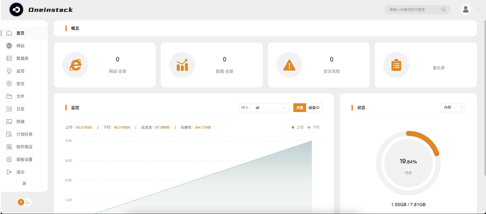
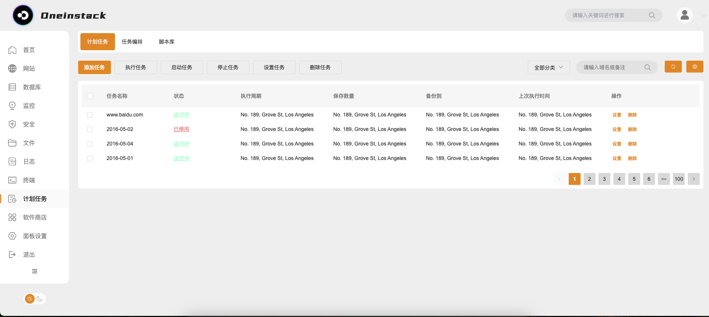
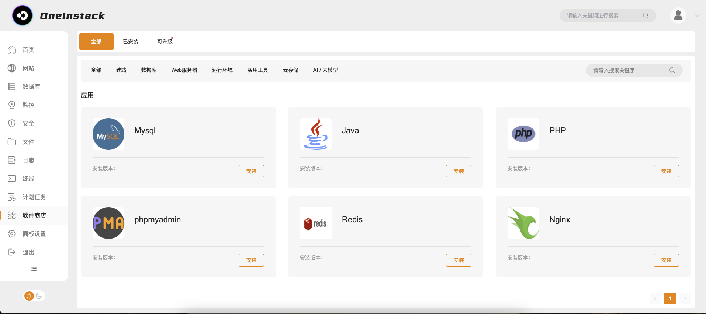

<h1 align="center">Oneinstack 服务器管理面板</h1>

[](https://github.com/oneinstack/Oneinstack-Panel/network)
[](https://github.com/oneinstack/Oneinstack-Panel/stargazers)
[](https://github.com/oneinstack/Oneinstack-Panel/blob/main/LICENSE)


> 一款开源的 Linux 服务器运维管理面板，让服务器管理更简单、更安全、更高效

## 语言

- [简体中文](README-zh.md)
- [English](README.md)

当前最新构建：`v0.3.0-build.11`（主分支包含后续修复）

## 🚀 功能特性

- 🛡️ 可视化服务器状态监控（CPU/内存/磁盘/网络）
- 🔧 软件商城与组件包管理（Nginx/MySQL/Redis/PHP 等）
- 🐳 Docker 容器、镜像、网络、卷、Compose 和受控终端管理
- 🔐 防火墙、端口转发、自动封禁、Fail2ban 与 SSH 管理
- 🧾 HMAC 防篡改操作审计、筛选、完整性校验和 CSV 导出
- 🌐 网站、Nginx 配置、HTTPS 证书和 ACME 自动续期
- 📁 文件管理、回收站、文件分享、数据库和备份恢复
- 🔄 定时任务管理（Crontab）
- 📈 指标历史、服务健康检查、监控规则、告警事件和通知渠道
- 🖥️ 堡垒机服务器管理、连接测试和指标采集
- 🧩 配置快照、差异查看、预览执行、审批和审计
- [x] 📊 实时运行日志查看与分析
- [x] 📡 多语言 API 响应和操作界面

## 📦 快速安装

### 系统要求

- 操作系统：Linux；已验证 Ubuntu、Debian、CentOS、RHEL、Rocky、AlmaLinux、OpenCloudOS 和 Anolis
- 架构：linux/amd64 和 linux/arm64
- 内存：推荐 1GB 以上
- 磁盘空间：至少 20GB 可用空间
- 需要 root 权限、systemd 和 `prlimit`

未验证的 Linux 发行版可显式使用 `--allow-unsupported`，但生产环境建议使用已验证发行版。

下载匹配架构的发布包及对应 `.sha256` 文件，验证并解压。请在独立的临时目录中执行，避免在已经解压的发布目录内再次执行 `tar -xzf` 造成目录嵌套。安装完成后临时目录会自动清理。初始管理员密码通过权限受控的文件传入，不写入 Shell 历史：

```bash
VERSION="v0.3.0-build.11"
PACKAGE="one-linux-amd64-${VERSION}.tar.gz"
BASE_URL="https://mirrors.oneinstack.com/oneinstack"
(
  work_dir="$(mktemp -d "${TMPDIR:-/tmp}/oneinstack-install.XXXXXX")"
  trap 'rm -rf -- "$work_dir"' EXIT
  cd "$work_dir"

  wget -c "${BASE_URL}/${PACKAGE}"
  wget -c "${BASE_URL}/${PACKAGE}.sha256"
  sha256sum -c "${PACKAGE}.sha256"
  tar -xzf "${PACKAGE}"
  cd "${PACKAGE%.tar.gz}"

  read -r -s -p "请输入初始管理员密码: " PANEL_PASSWORD
  printf '\n'
  sudo install -m 0600 /dev/null /run/one-admin-password
  printf '%s\n' "$PANEL_PASSWORD" | sudo tee /run/one-admin-password >/dev/null
  unset PANEL_PASSWORD
  sudo ./install.sh --admin-user admin \
    --admin-password-file /run/one-admin-password
  sudo rm -f /run/one-admin-password
)
```

安装完成后访问：`http://服务器IP:8089`

HTTP 是默认且始终保留的面板入口，默认监听 `0.0.0.0`，无需域名即可通过服务器 IP 访问。管理员可以在“设置 → 面板访问方式”中另行启用独立 HTTPS 端口并配置证书；启用 HTTPS 不会关闭 HTTP，也不会强制跳转。若使用反向代理，可信代理列表默认留空，只应加入实际受控的代理 IP 或 CIDR。

安装器只使用已经校验的发布包内二进制和配置，不会替换软件源、关闭防火墙、修改内核参数或执行系统全量升级。

使用另一个已校验并解压的发布包更新，默认保留现有配置：

```bash
sudo ./install.sh --force
```

配置 Center 地址和可信更新公钥后，也可以在“设置 → 面板更新”中检查并安装 Center 分配的签名版本，或使用：

```bash
sudo one update check
sudo one update apply --yes
sudo one update status
sudo one update rollback --yes
```

Center 统一控制发布渠道、灰度百分比、实例范围和版本撤回；Panel 不直接信任 Center 的网络响应，而是再次校验固定 Ed25519 公钥、清单、制品大小和 SHA-256，再执行数据库迁移预检、版本原子切换和就绪检查。失败时自动恢复旧二进制、数据库、配置和内置组件脚本。密钥配置、手工恢复和发布流程见 [BUILD.md](BUILD.md)。

### Center 控制的软件商城与面板更新

软件商城和组件脚本包注册中心共用同一套可信 Center 连接。配置
`scriptCenter.enabled`、`scriptCenter.url` 和
`scriptCenter.trustedKeys` 中固定的 Ed25519 公钥后，Panel 会在启动时获取
`/v1/software/catalog`，默认每 15 分钟自动同步一次。

Center 统一控制商城显示的软件和版本、推荐版本、是否允许新装、排序、标签、
更新说明以及对应的组件包。Panel 只有在目录签名和修订摘要校验通过后，才会
在一个数据库事务中应用新目录。Center 临时不可用时继续使用上一次可信快照；
Center 移除的软件不再允许新装，但已经安装的实例仍会显示，可继续管理服务或卸载。

```yaml
scriptCenter:
  enabled: true
  url: 'https://center.example.com'
  channel: 'stable'
  catalogSyncIntervalMinutes: 15
  catalogStaleAfterHours: 24
  trustedKeys:
    center-key-id: 'BASE64_ED25519_PUBLIC_KEY'

updateCenter:
  enabled: true
  centerUrl: 'https://center.example.com'
  channel: 'stable'
  healthTimeoutSeconds: 60
  backupRetention: 5
  trustedKeys: {}
```

仅在本机开发 Center 且使用 HTTP 时设置 `allowInsecureHTTP: true`，生产环境
必须使用 HTTPS。管理员可在软件商城页面查看当前数据来源，并手动刷新目录。

普通卸载会保留配置、数据库、日志和备份：

```bash
sudo ./install.sh uninstall
```

永久删除必须同时提供两个破坏性确认参数：

```bash
sudo ./install.sh uninstall --purge --yes
```

## 🖥️ 管理功能

### 服务器管理

- 实时资源监控



- 防火墙规则配置



- SSH 端口管理

- 系统服务管理
- 定时任务管理
- 监控规则、服务健康检查和告警通知
- 配置快照、预览执行、审批和审计
- 堡垒机服务器与会话指标



- 系统更新提醒

### 应用管理

- 软件商城与签名组件包
- 软件安装、升级、卸载和服务配置
- Docker 容器、镜像、网络、卷和 Compose
- 数据库连接、备份和恢复

### 网站管理

- 网站生命周期、配置预览与快照恢复
- 静态托管和反向代理
- HTTPS 证书、ACME 签发、续期和停用
- 网站备份、恢复和任务日志

## 🛠️ 技术架构

- 核心语言：Go
- 前端框架：Vue.js
- 数据库：SQLite
- 进程管理：Systemd
- 生产目标：Linux amd64/arm64

## 🤝 参与贡献

我们欢迎任何形式的贡献！

## 📄 开源协议

本项目采用 [Apache License 2.0](LICENSE) 开源协议。

---

> 🌍 官网地址：[https://oneinstack.com](https://oneinstack.com)  
> 🐛 问题反馈：[GitHub Issues](https://github.com/oneinstack/Oneinstack-Panel/issues)
