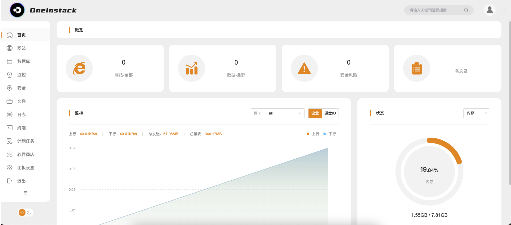
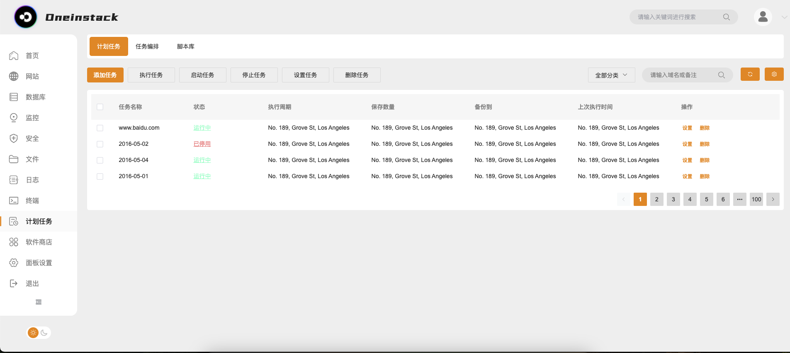

<h1 align="center">Oneinstack 服务器管理面板</h1>

[](https://github.com/guangzhengli/oneinstack/network)
[](https://github.com/guangzhengli/oneinstack/stargazers)
[](https://github.com/guangzhengli/oneinstack/blob/main/LICENSE)


> 一款开源的 Linux 服务器运维管理面板，让服务器管理更简单、更安全、更高效

## 🚀 功能特性

- 🛡️ 可视化服务器状态监控（CPU/内存/磁盘/网络）
- 🔧 一键安装常用服务/软件（Nginx/MySQL/Redis 等）
- 🔐 自动防火墙配置与管理
- 🌐 网站/FTP
- 🔄 定时任务管理（Crontab）
- [ x ] 📊 实时日志查看与分析
- [ x ] 数据库可视化管理
- [ x ] ⚡ 内置 BBR 网络加速优化
- [ x ] 📡 支持多语言操作界面

## 📦 快速安装

### 系统要求

- 操作系统：CentOS 7+/Ubuntu 20.04+
- 内存：推荐 1GB 以上
- 磁盘空间：至少 20GB 可用空间
- 需要 root 权限

### 安装命令

#### CentOS

```bash
wget -O install_centos.sh https://raw.githubusercontent.com/guangzhengli/oneinstack/main/install-cent.sh
chmod +x install_centos.sh
./install_centos.sh
```

#### Ubuntu

```bash
wget -O install_ubuntu.sh https://raw.githubusercontent.com/guangzhengli/oneinstack/main/install-ubuntu.sh
chmod +x install_ubuntu.sh
./install_ubuntu.sh
```

安装完成后访问：`http://你的服务器IP:8089`

## 🖥️ 管理功能

### 服务器管理

- 实时资源监控



- 防火墙规则配置



- SSH 端口管理

- 系统服务管理
- 定时任务管理


- 系统更新提醒

### 应用管理

- 一键安装：
  - Web 服务器：Nginx
  - 数据库：MySQL/Redis
  - 运行环境：PHP/JAVA

### 网站管理

- 静态代理
- 反向代理

## 🛠️ 技术架构

- 核心语言：Go
- 前端框架：Vue.js
- 数据库：SQLite
- 进程管理：Systemd

## 🤝 参与贡献

我们欢迎任何形式的贡献！

## 📄 开源协议

本项目采用 [MIT License](LICENSE) 开源协议。

---

> 🌍 官网地址：[https://oneinstack.com](https://oneinstack.com)  
> 🐛 问题反馈：[GitHub Issues](https://github.com/guangzhengli/oneinstack/issues)
